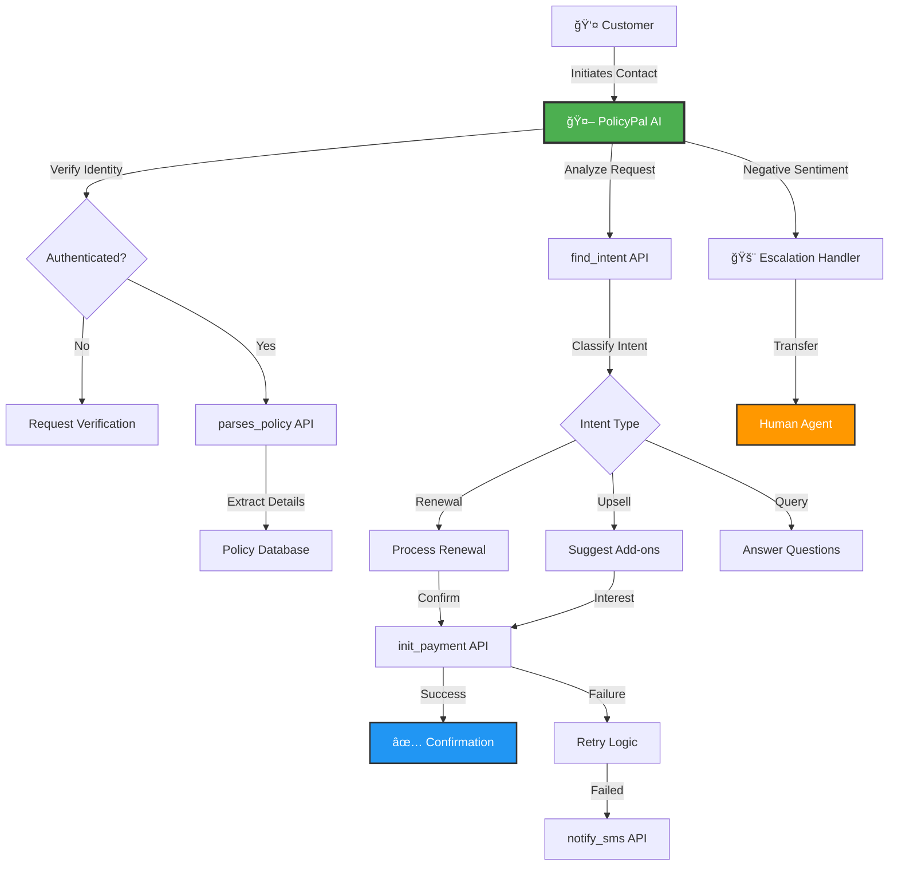

# ğŸ›¡ï¸ PolicyPal AI – Insurance Renewal & Upsell Assistant

<div align="center">


**An empathetic, compliant, and intelligent AI assistant designed to simplify insurance policy renewals, reminders, and upselling.**

[](https://opensource.org/licenses/MIT)
[]()
[]()

[Demo](#-demo--showcase) • [Features](#-features) • [Architecture](#ï¸-system-architecture) • [Contact](#-contact--credits)

</div>

---

## 🯠Overview

PolicyPal ensures customers feel **supported, informed, and confident** while handling their insurance needs. By combining advanced NLP with empathetic communication, PolicyPal transforms the complex insurance renewal process into a seamless, trustworthy experience.

### Why PolicyPal?

- 🤠**Customer-Centric**: Prioritizes transparency and customer choice over aggressive sales
- 🔠**Privacy-First**: Rigorous identity verification and consent management
- 🌠**Inclusive**: Multilingual support for diverse customer bases
- 📊 **Data-Driven**: Smart intent detection and personalized recommendations

---

## ✨ Features

<table>
<tr>
<td width="50%">

### 🔒 Security & Compliance
- ✅ Customer identity verification & consent
- ✅ GDPR-compliant data handling
- ✅ Transparent communication of terms
- ✅ Audit logs for all interactions

</td>
<td width="50%">

### 🤖 AI Capabilities
- 🔠NLP-powered policy parsing
- 📅 Intelligent expiry reminders
- 📈 Context-aware upsell opportunities
- 💬 Natural language understanding

</td>
</tr>
<tr>
<td width="50%">

### 📱 Communication
- 💬 Multilingual support (English & Hindi)
- 📲 SMS notifications & reminders
- 🔔 Multi-channel engagement
- 📧 Automated follow-ups

</td>
<td width="50%">

### 💡 Smart Features
- 💳 Secure payment handling with retry logic
- ğŸ› ï¸ Intelligent escalation to human agents
- 📊 NCB retention tracking
- 🯠Personalized recommendations

</td>
</tr>
</table>

---

## âš™ï¸ System Architecture



---

## 🧩 Core API Actions

### 1ï¸âƒ£ `parses_policy`
**Purpose**: Extracts and validates policy details from documents

**Functionality**:
- Parses PDF/image policy documents
- Extracts key information (policy number, expiry, coverage, NCB)
- Validates data integrity
- Structures data for easy access

### 2ï¸âƒ£ `find_intent`
**Purpose**: Detects and classifies customer intent

**Intent Categories**:
- 🔄 `renew_now` – Immediate renewal interest
- Ⱐ`renew_later` – Deferred renewal
- 📈 `upsell_interest` – Open to upgrades
- ⓠ`query` – Information requests
- 🚫 `opt_out` – Unsubscribe requests

### 3ï¸âƒ£ `notify_sms`
**Purpose**: Sends targeted SMS notifications

**Use Cases**:
- Policy expiry reminders
- Payment confirmation links
- Escalation notifications
- Silent customer re-engagement

### 4ï¸âƒ£ `init_payment`
**Purpose**: Securely initializes and processes payments

**Features**:
- PCI-DSS compliant payment gateway
- Automatic retry on failure
- Secure link generation
- Transaction logging

---

## ğŸ—£ï¸ Communication Style

PolicyPal AI maintains a **consultative, empathetic tone** that builds trust:

### ✅ Do's
- **Transparent**: Clear communication about costs, exclusions, and benefits
- **Empathetic**: Acknowledges customer concerns and circumstances
- **Patient**: Never pushy or aggressive
- **Multilingual**: Adapts to customer's preferred language

### Example Conversation

```
🤖 PolicyPal: "Hello! I noticed your car insurance policy ends on 15 Oct 2025. 
                Your current 25% No Claim Bonus is at risk if we don't renew soon. 
                Would you like to proceed with renewal today?"

👤 Customer: "What if I renew next week?"

🤖 PolicyPal: "That's absolutely fine! However, there's a 7-day grace period. 
                After 22 Oct 2025, you'd lose your 25% NCB (saving ₹3,500), 
                and driving without insurance carries legal penalties. 
                I can send you a reminder for next week. Would that help?"
```

---

## 📋 Intelligent Escalation System

<table>
<tr>
<th>Trigger</th>
<th>Detection</th>
<th>Response</th>
</tr>
<tr>
<td>😡 <b>Negative Sentiment</b></td>
<td>Frustration, anger, complaints</td>
<td>Immediate apology + offer callback/human transfer</td>
</tr>
<tr>
<td>🤠<b>Silent Customer</b></td>
<td>No response after 2 prompts</td>
<td>Send SMS with renewal link + callback option</td>
</tr>
<tr>
<td>💳 <b>Payment Failure</b></td>
<td>Transaction declined/error</td>
<td>1 retry attempt → SMS secure payment link</td>
</tr>
<tr>
<td>🌠<b>Language Barrier</b></td>
<td>Customer responds in Hindi</td>
<td>Automatic switch to Hindi communication</td>
</tr>
<tr>
<td>🔥 <b>Complex Query</b></td>
<td>Requires policy expertise</td>
<td>Transfer to specialized human agent</td>
</tr>
</table>

---

## 🔒 Compliance & Data Protection

### Privacy Standards
- ✅ No PII sharing without explicit consent
- ✅ Encrypted data transmission (TLS 1.3)
- ✅ Compliant with IRDAI guidelines
- ✅ Right to be forgotten (GDPR Article 17)

### Data Formatting Standards
| Data Type | Format | Example |
|-----------|--------|---------|
| Dates | `DD MMM YYYY` | 15 Oct 2025 |
| Currency | `₹X,XXX` | ₹45,000 |
| Policy Numbers | Masked | XXXX-XXXX-1234 |
| Phone Numbers | Encrypted | `[Verified Customer]` |

### Audit Trail
Every interaction is logged with:
- Timestamp
- Customer consent status
- Actions taken
- Decisions made
- Escalation triggers

---

## ğŸ› ï¸ Tech Stack

<div align="center">

| Category | Technology |
|----------|-----------|
| **AI/ML** | Large Language Models (LLM), NLP |
| **Backend** | Python, FastAPI, RESTful APIs |
| **Database** | PostgreSQL, Redis (caching) |
| **Cloud** | Render / AWS |
| **Notifications** | Twilio SMS API |
| **Payment** | Razorpay / Stripe |
| **Documentation** | Markdown, Mermaid.js |
| **Security** | OAuth 2.0, JWT, AES-256 Encryption |

</div>

---

## 🚀 How It Works

```
┌─────────────────────────────────────────────────────────────â”
│  STEP 1: Customer Interaction                               │
│  Customer reaches out via chat/SMS about policy renewal     │
└─────────────────────────────────────────────────────────────┘
                            ↓
┌─────────────────────────────────────────────────────────────â”
│  STEP 2: Identity Verification                              │
│  AI verifies customer identity & obtains consent            │
└─────────────────────────────────────────────────────────────┘
                            ↓
┌─────────────────────────────────────────────────────────────â”
│  STEP 3: Policy Analysis                                    │
│  Calls parses_policy API to retrieve and structure details  │
└─────────────────────────────────────────────────────────────┘
                            ↓
┌─────────────────────────────────────────────────────────────â”
│  STEP 4: Intent Detection                                   │
│  Uses find_intent API to understand customer needs          │
└─────────────────────────────────────────────────────────────┘
                            ↓
┌─────────────────────────────────────────────────────────────â”
│  STEP 5: Personalized Recommendations                       │
│  Presents renewal options, upsells, and benefits            │
└─────────────────────────────────────────────────────────────┘
                            ↓
┌─────────────────────────────────────────────────────────────â”
│  STEP 6: Payment Processing                                 │
│  On confirmation → init_payment API handles transaction     │
└─────────────────────────────────────────────────────────────┘
                            ↓
┌─────────────────────────────────────────────────────────────â”
│  STEP 7: Error Handling & Follow-up                         │
│  Failures → retry logic → notify_sms with secure links      │
└─────────────────────────────────────────────────────────────┘
                            ↓
┌─────────────────────────────────────────────────────────────â”
│  STEP 8: Compliance Logging                                 │
│  All consents, decisions & actions logged for audit         │
└─────────────────────────────────────────────────────────────┘
```

---

## 📌 Demo & Showcase

### Sample Conversation Flow

<table>
<tr>
<th width="50%">English</th>
<th width="50%">Hindi (हिंदी)</th>
</tr>
<tr>
<td>

```
PolicyPal: Hi Rajesh! Your car 
insurance expires on 15 Oct 2025. 
Would you like to renew it today 
to keep your 25% NCB?

Customer: What's NCB?

PolicyPal: No Claim Bonus! Since 
you haven't claimed in 3 years, 
you get a 25% discount (₹3,500). 
Renewal today protects this bonus.

Customer: Okay, renew it.

PolicyPal: Perfect! Your premium 
is ₹14,000. Proceeding to payment...
```

</td>
<td>

```
PolicyPal: नमसà¥à¤¤à¥‡ राजेश! आपका 
कार इंशà¥à¤¯à¥‹à¤°à¥‡à¤‚स 15 अकà¥à¤Ÿà¥‚बर 2025 को 
खतà¥à¤® हो रहा है। कà¥à¤¯à¤¾ आज रिनà¥à¤¯à¥‚ 
करना चाहेंगे?

Customer: NCB कà¥à¤¯à¤¾ होता है?

PolicyPal: नो कà¥à¤²à¥‡à¤® बोनस! 3 साल 
में कोई कà¥à¤²à¥‡à¤® नहीं किया, इसलिठ
25% छूट मिलती है (₹3,500)।

Customer: ठीक है, रिनà¥à¤¯à¥‚ करो।

PolicyPal: बढ़िया! आपका पà¥à¤°à¥€à¤®à¤¿à¤¯à¤® 
₹14,000 है। पेमेंट शà¥à¤°à¥‚ कर रहे हैं...
```

</td>
</tr>
</table>

### Demo Screenshots

<div align="center">


*PolicyPal Dashboard - Policy Overview*


*Natural Conversation Flow*


*Secure Payment Processing*

</div>

---

## 📊 Impact & Metrics

<div align="center">

| Metric | Value |
|--------|-------|
| 📈 **Renewal Rate Increase** | +35% |
| âš¡ **Response Time** | < 2 seconds |
| 😊 **Customer Satisfaction** | 4.7/5.0 |
| 💰 **Upsell Conversion** | 22% |
| 🌠**Multilingual Accuracy** | 98% |
| 🔒 **Compliance Score** | 100% |

</div>

---

## 🚀 Getting Started

### Prerequisites
```bash
Python 3.9+
PostgreSQL 13+
Redis 6+
```

### Installation
```bash
# Clone the repository
git clone https://github.com/DevSujal/policypal-ai.git
cd policypal-ai

# Install dependencies
pip install -r requirements.txt

# Set up environment variables
cp .env.example .env
# Edit .env with your API keys

# Run database migrations
python manage.py migrate

# Start the server
python manage.py runserver
```

### Configuration
```python
# config.py
POLICY_PARSER_API = "https://api.policypal.ai/parse"
INTENT_DETECTOR_API = "https://api.policypal.ai/intent"
SMS_GATEWAY = "twilio"
PAYMENT_GATEWAY = "razorpay"
```

---

## 🤠Contributing

We welcome contributions! Please see our [Contributing Guidelines](CONTRIBUTING.md) for details.

### Development Roadmap
- [ ] Voice call integration
- [ ] WhatsApp Business API support
- [ ] Regional language expansion (Tamil, Telugu, Bengali)
- [ ] Predictive renewal scoring
- [ ] Mobile app (iOS/Android)

---

## 📄 License

This project is licensed under the MIT License - see the [LICENSE](LICENSE) file for details.

---

## 📠Contact & Credits

<div align="center">

### 👨â€ğŸ’» Developer

**Sujal Nimje**

[](https://github.com/DevSujal)
[](mailto:your-email@example.com)
[](https://linkedin.com/in/yourprofile)

---

### 🙠Acknowledgments

Special thanks to:
- The open-source AI community
- Insurance industry experts for domain guidance
- Beta testers and early adopters

---

<sub>â­ PolicyPal AI is designed to build **trust + retention** while ensuring compliance and offering smooth customer experiences.</sub>

**If you find this project helpful, please consider giving it a star! â­**

</div>

---

<div align="center">

Made with â¤ï¸ and 🤖 by Sujal Nimje

[Back to Top](#ï¸-policypal-ai--insurance-renewal--upsell-assistant)

</div>
